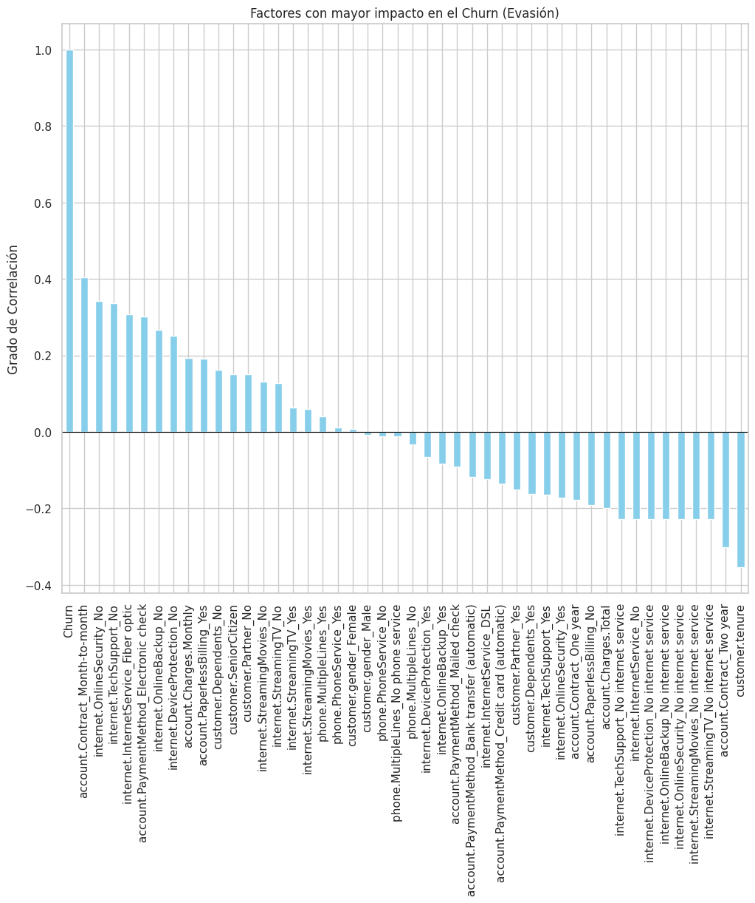
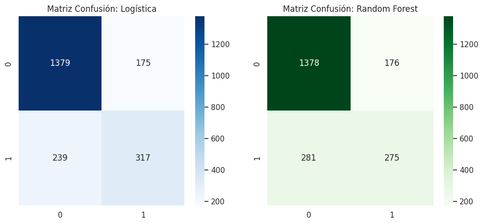
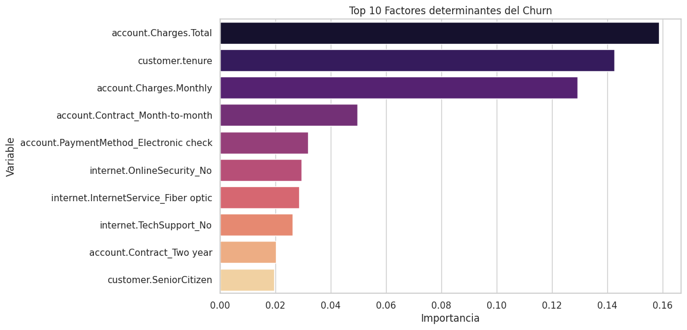

# 📊 Proyecto Telecom X - Predicción de Churn (Parte 2)

## 🎯 Propósito del Análisis
El objetivo principal de este proyecto es desarrollar un modelo de **Machine Learning** capaz de predecir el *churn* (cancelación) de clientes. Mediante el análisis de variables demográficas y de servicios, identificamos patrones críticos que permiten a la empresa ejecutar estrategias de retención proactivas antes de que el cliente abandone el servicio.

## 📂 Estructura del Proyecto
* [**`/datos`**](./datos): Contiene el dataset `datos_tratados.csv` (resultado de la limpieza en la Parte 1).
* [**`/notebooks`**](./notebooks): Cuaderno principal `TelecomX_Parte2_MachineLearning.ipynb` con el flujo de desarrollo.
* [**`/visualizaciones`**](./visualizaciones): Gráficos exportados durante el análisis y evaluación.

## 🛠️ Preparación de los Datos
Para garantizar la estabilidad de los modelos, se ejecutaron las siguientes etapas en el entorno de Google Colab:
* **Clasificación**: Identificación de variables categóricas (como tipo de internet) y numéricas (como cargos mensuales).
* **Tratamiento de Nulos**: Se aplicó `dropna()` post-encoding para eliminar valores vacíos que impedían el entrenamiento.
* **Codificación (Encoding)**: Uso de `pd.get_dummies` (One-Hot Encoding) para transformar categorías en datos numéricos.
* **Normalización**: Aplicación de `StandardScaler` para el modelo de Regresión Logística, asegurando que todas las variables tengan la misma escala.
* **División del Dataset**: Separación en **70% para entrenamiento** y **30% para prueba** (`train_test_split`).

## 🤖 Modelado y Justificación
Se implementaron dos enfoques distintos para comparar su rendimiento:
1. **Regresión Logística**: Modelo lineal elegido por su alta interpretabilidad y eficiencia en problemas de clasificación binaria.
2. **Random Forest**: Modelo basado en árboles de decisión, elegido por su robustez ante datos no lineales y por no requerir normalización previa.

## 📈 Insights y Visualizaciones

### 1. Análisis de Correlación

*El análisis determinó que los contratos mensuales (**Month-to-month**) y los servicios de fibra óptica tienen la mayor correlación con la fuga de clientes.*

### 2. Comparativa de Modelos (Matrices de Confusión)

*Las matrices permiten visualizar la eficacia de cada modelo para predecir correctamente tanto a los clientes que se quedan como a los que se van.*

### 3. Importancia de Variables

*Mediante Random Forest, identificamos que la **antigüedad (tenure)** y los **cargos mensuales** son los factores que más influyen en la decisión final del cliente.*

## 📋 Análisis Crítico y Estrategia Sugerida
Tras evaluar ambos modelos (logrando un **Accuracy de ~80%**), se concluye:
* **Hallazgo**: El tipo de contrato es el predictor más fuerte de abandono.
* **Acción sugerida**: Telecom X debe incentivar la migración de clientes con contratos mensuales hacia planes anuales mediante descuentos en servicios de seguridad técnica, atacando así el principal foco de evasión.

## 🚀 Instrucciones de Ejecución
1. Clonar el repositorio.
2. Instalar las dependencias necesarias:
   ```bash
   pip install pandas numpy matplotlib seaborn scikit-learn
